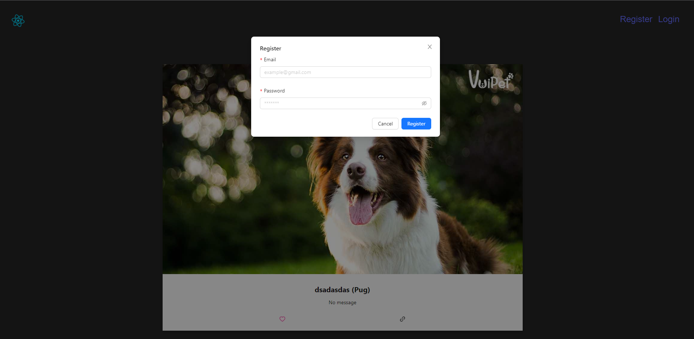
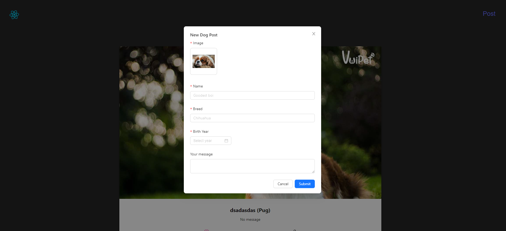
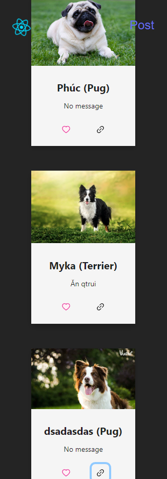

# Challenge Results

## Register and Login

- The user shall register and login to the system using email and password.
- When the user registers, the password is hashed and stored in the database.
- When the user logs in successfully, the server returns a Paseto token to the client under Set-Cookie header for better security.

## Post and View

- The user shall be able to upload an image of a dog together with its data.
- The user shall be able to view the list of images of dogs.
- The user shall be able to view dog recommendation based on their dog breed input and dog breed AWS Rekognition detection.

- In this image, the user has uploaded a dog image of a Collie. The user has entered the dog breed as a Pug. The system has recommended the dog images of both Pug and Collie dogs based on the input breed and the assigned labels.
